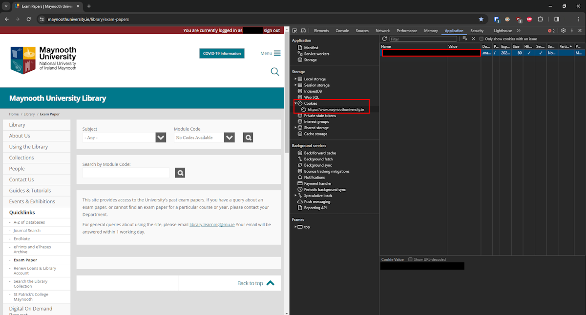

# paperboy

Download Maynooth University past exam papers with this command line program


## Usage

You will need to create a `config.json` file with the cookie that grants access to the service. Place this file at the root directory of this repo.

1. In Chrome, log in to the [exam papers website](https://www.maynoothuniversity.ie/library/exam-papers)
2. Press F12 to open Developer Tools and go to the Application tab
3. Go to Cookies >> https://www.maynoothuniversity.ie and copy and paste the Name and Value of the cookie into your config file
4. Don't share this cookie or accidentally push it to any repo



```json
// config.json
{
    "cookies": {
        "cookie_name": "cookie_value"
    }
}
```

## Argumemts

1. Module code e.g. CS404
2. Year range lower bound (inclusive)
3. Year range upper bound (non-inclusive)

E.g.

```
python ./paperboy.py CS434 2010 2015
python ./paperboy.py CS434 2018
python ./paperboy.py MP472
```